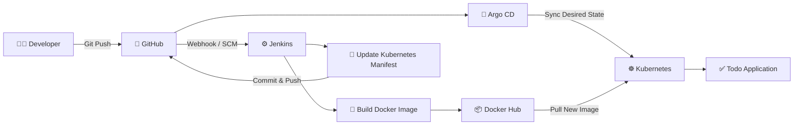

# 🚀 Django Todo App — Jenkins CI/CD + Argo CD GitOps

<p align="center">
  <b>End-to-End CI/CD Pipeline using Docker, Jenkins, Kubernetes and Argo CD</b>
</p>

<p align="center">
  🐍 Python & Django • 🐳 Docker • ⚙️ Jenkins • ☸️ Kubernetes • 🔄 Argo CD • 🐙 GitHub
</p>

---

## 📌 Project Overview

This project demonstrates an **end-to-end CI/CD and GitOps workflow** for a simple Todo application built with **Python and Django**.

The application is:

- Containerized using **Docker**
- Built and versioned automatically using **Jenkins**
- Pushed to **Docker Hub**
- Deployed to a **Kubernetes cluster**
- Managed through Kubernetes manifests stored in Git
- Continuously synchronized using **Argo CD**
- Updated automatically whenever Jenkins produces a new Docker image

The main purpose of this project is to demonstrate how **CI and CD can be separated using Jenkins and Argo CD**, while Git acts as the **single source of truth** for Kubernetes deployments.

---

## 🏗️ CI/CD Architecture



### Pipeline Flow

```text
Developer
    │
    │ git push
    ▼
GitHub Repository
    │
    ▼
Jenkins
    │
    ├── Build Docker Image
    │
    ├── Tag Image with Jenkins BUILD_NUMBER
    │
    ├── Push Image to Docker Hub
    │
    ├── Update Kubernetes deploy.yaml
    │
    └── Push Manifest Change to GitHub
    │
    ▼
Argo CD
    │
    ├── Detect Git Change
    ├── Compare Desired vs Live State
    └── Sync Kubernetes Cluster
    │
    ▼
Kubernetes
    │
    ▼
Updated Todo Application 🚀
```

---

## 🛠️ Technology Stack

| Technology | Purpose |
|---|---|
| Python | Application programming language |
| Django | Web application framework |
| Docker | Application containerization |
| Docker Compose | Local container execution |
| Docker Hub | Docker image registry |
| Jenkins | Continuous Integration |
| GitHub | Source code and Kubernetes manifest repository |
| Kubernetes | Container orchestration |
| Argo CD | GitOps-based Continuous Delivery |
| Git | Source code version control |

---

## 📂 Project Structure

```text
python-jenkins-project/
│
├── kubernetes/
│   ├── deploy.yaml
│   └── service.yaml
│
├── staticfiles/
├── todoApp/
├── todos/
│
├── Dockerfile
├── docker-compose.yml
├── Jenkinsfile
├── manage.py
├── db.sqlite3
├── LICENSE
└── README.md
```


# 🐳 Run application locally

The application is containerized using Docker.

The Docker image uses Python as the base image and runs the Django application on:

```text
Port 8000
```

Build the image manually:

```bash
docker build -t todo-app .
```

Run the container:

```bash
docker run -d \
  --name todo-app \
  -p 8000:8000 \
  todo-app
```

Open the application:

```text
http://localhost:8000
```

---

# 🐳 Docker Compose

Docker Compose can also be used to build and run the application locally.

Start the application:

```bash
docker compose up -d --build
```

Check the running container:

```bash
docker compose ps
```

Access the application:

```text
http://localhost:8000
```

Stop the application:

```bash
docker compose down
```


# 👨‍💻 Author

**Ramasubramanian**

Aspiring DevOps / Cloud Engineer

GitHub: **ramasubramanian06**

---

<p align="center">
  ⭐ If you found this project useful, consider giving the repository a star!
</p>

<p align="center">
  <b>Built with Docker 🐳 | Automated with Jenkins ⚙️ | Deployed with Kubernetes ☸️ | Managed by Argo CD 🔄</b>
</p>
