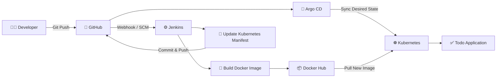

# 🚀 Django Todo App — Jenkins CI/CD + Argo CD GitOps

<p align="center">
  <b>End-to-End CI/CD Pipeline using Docker, Jenkins, Kubernetes and Argo CD</b>
</p>

<p align="center">
  🐍 Python & Django • 🐳 Docker • ⚙️ Jenkins • ☸️ Kubernetes • 🔄 Argo CD • 🐙 GitHub
</p>

---

## 📌 Project Overview

This project demonstrates an **end-to-end CI/CD and GitOps workflow** for a simple Todo application built with **Python and Django**.

The application is:

- Containerized using **Docker**
- Built and versioned automatically using **Jenkins**
- Pushed to **Docker Hub**
- Deployed to a **Kubernetes cluster**
- Managed through Kubernetes manifests stored in Git
- Continuously synchronized using **Argo CD**
- Updated automatically whenever Jenkins produces a new Docker image

The main purpose of this project is to demonstrate how **CI and CD can be separated using Jenkins and Argo CD**, while Git acts as the **single source of truth** for Kubernetes deployments.

---

## 🏗️ CI/CD Architecture



### Pipeline Flow

```text
Developer
    │
    │ git push
    ▼
GitHub Repository
    │
    ▼
Jenkins
    │
    ├── Build Docker Image
    │
    ├── Tag Image with Jenkins BUILD_NUMBER
    │
    ├── Push Image to Docker Hub
    │
    ├── Update Kubernetes deploy.yaml
    │
    └── Push Manifest Change to GitHub
    │
    ▼
Argo CD
    │
    ├── Detect Git Change
    ├── Compare Desired vs Live State
    └── Sync Kubernetes Cluster
    │
    ▼
Kubernetes
    │
    ▼
Updated Todo Application 🚀
```

---

## 🛠️ Technology Stack

| Technology | Purpose |
|---|---|
| Python | Application programming language |
| Django | Web application framework |
| Docker | Application containerization |
| Docker Compose | Local container execution |
| Docker Hub | Docker image registry |
| Jenkins | Continuous Integration |
| GitHub | Source code and Kubernetes manifest repository |
| Kubernetes | Container orchestration |
| Argo CD | GitOps-based Continuous Delivery |
| Git | Source code version control |

---

## 📂 Project Structure

```text
python-jenkins-project/
│
├── kubernetes/
│   ├── deploy.yaml
│   └── service.yaml
│
├── staticfiles/
├── todoApp/
├── todos/
│
├── Dockerfile
├── docker-compose.yml
├── Jenkinsfile
├── manage.py
├── db.sqlite3
├── LICENSE
└── README.md
```

### Important Files

**Dockerfile**

Used to build the Django application Docker image.

**Jenkinsfile**

Defines the CI pipeline responsible for:

```text
Checkout Code
      ↓
Build Docker Image
      ↓
Push Image to Docker Hub
      ↓
Update Kubernetes Manifest
      ↓
Commit & Push Manifest to GitHub
```

**kubernetes/deploy.yaml**

Defines the Kubernetes Deployment and application container image.

**kubernetes/service.yaml**

Exposes the application using a Kubernetes `NodePort` service.

---

# 🐳 Docker Implementation

The application is containerized using Docker.

The Docker image uses Python as the base image and runs the Django application on:

```text
Port 8000
```

Build the image manually:

```bash
docker build -t todo-app .
```

Run the container:

```bash
docker run -d \
  --name todo-app \
  -p 8000:8000 \
  todo-app
```

Open the application:

```text
http://localhost:8000
```

---

# 🐳 Docker Compose

Docker Compose can also be used to build and run the application locally.

Start the application:

```bash
docker compose up -d --build
```

Check the running container:

```bash
docker compose ps
```

Access the application:

```text
http://localhost:8000
```

Stop the application:

```bash
docker compose down
```

---

# ⚙️ Jenkins CI Pipeline

Jenkins is responsible for the **Continuous Integration** part of the project.

The pipeline uses the Jenkins build number as the Docker image tag.

For example:

```text
Build #11 → ramasubramanian06/todo-app:11
Build #12 → ramasubramanian06/todo-app:12
Build #13 → ramasubramanian06/todo-app:13
```

This gives every application build a unique and traceable Docker image version.

---

## Jenkins Pipeline Stages

### 1️⃣ Checkout

Jenkins clones the application source code from GitHub.

```text
GitHub
   ↓
Jenkins Workspace
```

---

### 2️⃣ Build Docker Image

Jenkins builds the Docker image using:

```bash
docker build -t ${IMAGE_NAME}:${IMAGE_TAG} .
```

Example:

```text
ramasubramanian06/todo-app:13
```

---

### 3️⃣ Push Docker Image

Jenkins authenticates with Docker Hub using credentials stored securely in Jenkins.

The newly built image is then pushed to:

```text
Docker Hub
      ↓
ramasubramanian06/todo-app:<BUILD_NUMBER>
```

---

### 4️⃣ Update Kubernetes Manifest

After successfully pushing the Docker image, Jenkins updates:

```text
kubernetes/deploy.yaml
```

For example:

```yaml
image: ramasubramanian06/todo-app:12
```

becomes:

```yaml
image: ramasubramanian06/todo-app:13
```

---

### 5️⃣ Commit Manifest to GitHub

Jenkins commits the updated Kubernetes manifest:

```text
Update todo-app image to 13 [skip ci]
```

and pushes the change back to the `main` branch.

This ensures that **Git always contains the desired Kubernetes state**.

---

# ☸️ Kubernetes Deployment

The application is deployed using a Kubernetes Deployment.

The current configuration runs:

```text
3 replicas
```

Example:

```yaml
spec:
  replicas: 3
```

The application container listens on:

```text
8000
```

Check the deployment:

```bash
kubectl get deployments
```

Check pods:

```bash
kubectl get pods
```

---

## Kubernetes Service

The application is exposed using a `NodePort` service.

```text
Service Port : 80
Target Port  : 8000
NodePort     : 31000
```

Check the service:

```bash
kubectl get svc
```

Example:

```text
NAME           TYPE       PORT(S)
todo-service   NodePort   80:31000/TCP
```

---

# 🔄 Argo CD GitOps

Argo CD is responsible for the **Continuous Delivery** part of this project.

Unlike a traditional pipeline, Jenkins does **not need to directly deploy the new application version to Kubernetes**.

Instead:

```text
Jenkins
   │
   └── Updates deploy.yaml
            │
            ▼
          GitHub
            │
            ▼
         Argo CD
            │
            ▼
        Kubernetes
```

Argo CD continuously compares:

```text
Git Desired State
        VS
Kubernetes Live State
```

When Jenkins changes:

```yaml
image: ramasubramanian06/todo-app:12
```

to:

```yaml
image: ramasubramanian06/todo-app:13
```

Argo CD detects the difference.

Initially:

```text
Git         → todo-app:13
Kubernetes  → todo-app:12

Argo CD     → OutOfSync
```

After synchronization:

```text
Git         → todo-app:13
Kubernetes  → todo-app:13

Argo CD     → Synced ✅
```

---

# 🔐 Jenkins Credentials

The pipeline uses credentials stored securely in Jenkins rather than hardcoding usernames and passwords inside the Jenkinsfile.

### GitHub Credential

```text
Credential ID:
github-credentials
```

Used for:

```text
Repository checkout
Manifest commit/push
```

### Docker Hub Credential

```text
Credential ID:
dockerhub-credentials
```

Used for:

```text
docker login
docker push
```

This keeps sensitive credentials outside the source code.

---

# 🚀 Complete CI/CD Workflow

When a developer pushes a change:

### Step 1

```text
Developer → GitHub
```

### Step 2

Jenkins retrieves the latest application source code.

### Step 3

Jenkins builds a new Docker image.

```text
todo-app:<BUILD_NUMBER>
```

### Step 4

Jenkins pushes the image to Docker Hub.

### Step 5

Jenkins updates the image tag inside:

```text
kubernetes/deploy.yaml
```

### Step 6

Jenkins commits and pushes the modified manifest to GitHub.

### Step 7

Argo CD detects that Git has changed.

### Step 8

Argo CD synchronizes the desired state with Kubernetes.

### Step 9

Kubernetes pulls the new Docker image.

### Step 10

New pods are created with the updated application version.

```text
Code Change
    ↓
GitHub
    ↓
Jenkins
    ↓
Docker Image
    ↓
Docker Hub
    ↓
Manifest Update
    ↓
GitHub
    ↓
Argo CD
    ↓
Kubernetes
    ↓
🚀 Application Updated
```

---

# 📸 Project Screenshots

You can add your project screenshots here.

### Jenkins Pipeline

```text
images/jenkins-pipeline.png
```

### Docker Hub Image

```text
images/dockerhub.png
```

### Argo CD Application

```text
images/argocd.png
```

### Kubernetes Pods

```text
images/kubernetes.png
```

### Todo Application

```text
images/todo-app.png
```

After adding the images to the repository, replace the sections above with:

```markdown


```

---

# 💡 Key DevOps Concepts Demonstrated

This project demonstrates practical implementation of:

- Docker containerization
- Docker image versioning
- Jenkins Declarative Pipeline
- Jenkins Credentials Management
- Docker Hub integration
- Kubernetes Deployment
- Kubernetes Service
- Git-based configuration management
- CI/CD automation
- GitOps
- Argo CD synchronization
- Automated Kubernetes manifest updates
- Separation of CI and CD

---

# 🎯 CI vs CD in This Project

### Jenkins — Continuous Integration

```text
Checkout
   ↓
Docker Build
   ↓
Docker Push
   ↓
Update Kubernetes Manifest
   ↓
Push to GitHub
```

### Argo CD — Continuous Delivery

```text
Monitor Git
   ↓
Detect Manifest Change
   ↓
Compare Desired & Live State
   ↓
Sync
   ↓
Deploy to Kubernetes
```

This separation provides a clean GitOps-based deployment workflow.

---

# ⭐ Key Learning

The key concept implemented in this project is:

> **Jenkins builds the application, while Argo CD deploys the application.**

Jenkins does not need to continuously issue deployment commands against the Kubernetes cluster.

Instead, Jenkins updates the desired state stored in Git, and Argo CD ensures that the Kubernetes cluster matches that desired state.

```text
CI      → Jenkins
Registry → Docker Hub
GitOps   → GitHub
CD       → Argo CD
Runtime  → Kubernetes
```

---

# 👨‍💻 Author

**Ramasubramanian**

Aspiring DevOps / Cloud Engineer

GitHub: **ramasubramanian06**

---

# 📄 License

This project is licensed under the **Apache License 2.0**.

---

<p align="center">
  ⭐ If you found this project useful, consider giving the repository a star!
</p>

<p align="center">
  <b>Built with Docker 🐳 | Automated with Jenkins ⚙️ | Deployed with Kubernetes ☸️ | Managed by Argo CD 🔄</b>
</p>
